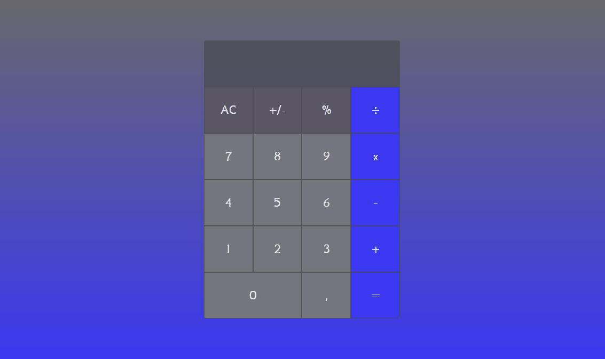

# Calculator

## About
Calculator created with HTML5, CSS3 and JavaScript. I especially improved my knowledge of CSS and JavaScript, by organizing the calculator in grid, and by doing the key mapping.

## Result

Access the project <a href="https://luk4x.github.io/projeto-calculadora/">HERE</a>

## Contributors Contact
<table>
  <tr>
    <td align="center">
      <a href="https://www.linkedin.com/in/lucasmacielf/">
         
        
          <b>Lucas Maciel</b>
        
      </a>
    </td>
  </tr>
</table>
